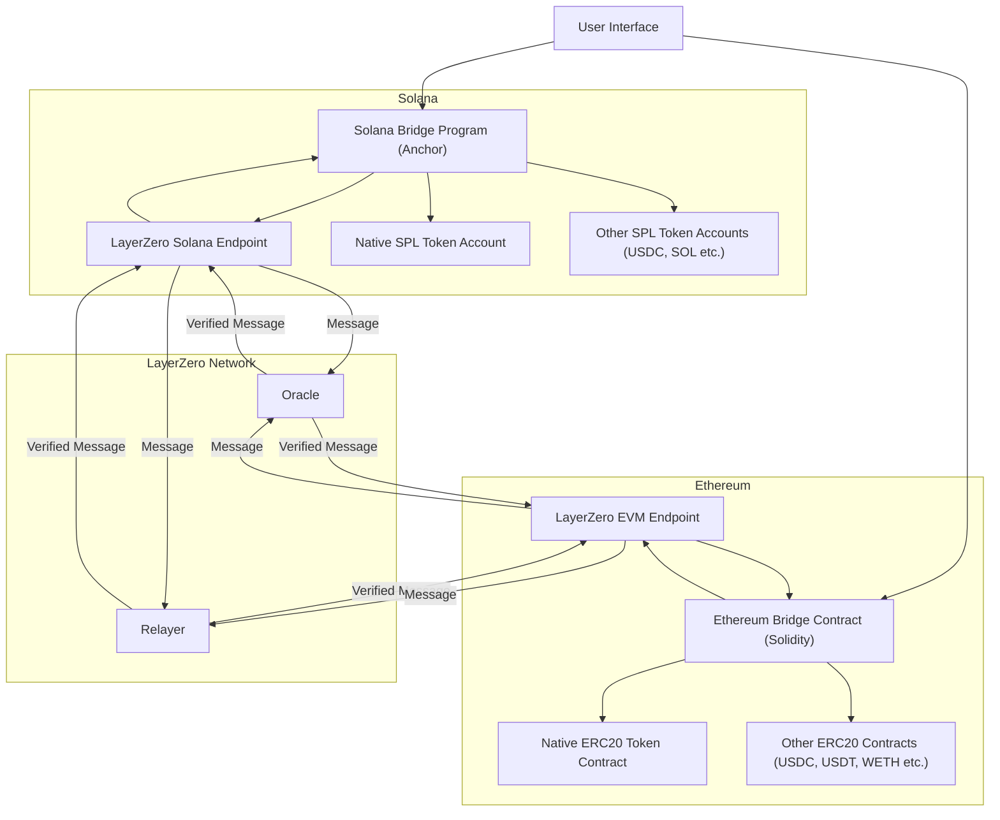

# Omnichain Token Bridge (LayerZero)

**Generated:** 2025-04-14
**User:** n4beel

## Overview

This project implements a cross-chain token bridge facilitating the transfer of assets between the Solana and Ethereum blockchains. It utilizes the LayerZero omnichain interoperability protocol as the underlying messaging layer to enable seamless communication and asset transfers between the two distinct ecosystems.

The primary goal is to allow users to bridge a native project token, which exists canonically on both Solana and Ethereum, as well as standard popular tokens like stablecoins and native chain assets (ETH/SOL) in the future. The architecture is designed with extensibility in mind, allowing for the future addition of more supported tokens and blockchains.

## Core Features & Specifications

*   **Cross-Chain Bridging:** Enables token transfers between Solana and Ethereum (and vice-versa).
*   **Native Token Support:** Allows bridging of the project's native token, maintaining a consistent supply across supported chains (likely using LayerZero's OFT - Omnichain Fungible Token standard).
*   **Standard Token Support:** Facilitates bridging of common assets [in progress]:
    *   USDC (SPL on Solana <-> ERC20 on Ethereum)
    *   USDT (SPL on Solana <-> ERC20 on Ethereum)
    *   SOL (Native/Wrapped SOL on Solana <-> Wrapped SOL representation on Ethereum, or potentially WETH via intermediate swap) - *Exact mechanism TBD*
    *   ETH (WETH ERC20 on Ethereum <-> Wrapped ETH representation on Solana)
*   **LayerZero Integration:** Leverages LayerZero Endpoints, Oracles, and Relayers for secure and reliable cross-chain message passing.
*   **Extensible Design:** The contracts/programs are structured to easily accommodate:
    *   Adding support for more tokens in the future.
    *   Integrating additional blockchains supported by LayerZero.
*   **User Interface:** A front-end application allowing users to connect Solana and EVM wallets, select chains/tokens, specify amounts, and initiate bridge transactions.

## Architecture

The system consists of smart contracts/programs deployed on each supported chain, a user interface, and the underlying LayerZero network.




**Components:**

1.  **User Interface (UI):** Handles user interaction, wallet connections, and transaction initiation.
2.  **Solana Bridge Program:** An Anchor program handling locking/burning/minting/unlocking of SPL tokens on Solana and interacting with the Solana LayerZero Endpoint.
3.  **Ethereum Bridge Contract:** A Solidity smart contract handling locking/burning/minting/unlocking of ERC20 tokens on Ethereum and interacting with the EVM LayerZero Endpoint.
4.  **Token Contracts:** The native token contracts (SPL & ERC20) and references to the standard tokens being bridged.
5.  **LayerZero Network:** The infrastructure (Endpoints, Oracle, Relayer) that passes messages between the chains.

## Technology Stack

*   **Interoperability Protocol:** LayerZero
*   **Solana Development:**
    *   Language: Rust
    *   Framework: Anchor
    *   SDK: `@solana/web3.js`
*   **Ethereum Development:**
    *   Language: Solidity
    *   Framework: Hardhat / Foundry (TBD)
    *   Libraries: Ethers.js / Viem, OpenZeppelin (potentially)
*   **Frontend:** (TBD - e.g., React, Vue, Svelte), Web3 libraries (Ethers.js/Viem, Solana Wallet Adapter)

## Getting Started (Placeholder)


### Prerequisites

*   Node.js
*   Rust & Cargo
*   Solana Tool Suite
*   Anchor CLI
*   Git
*   Docker (Optional)

### Installation

```bash
# Clone the repository
git clone https://github.com/n4beel/bootcamp-q1-2025-final-project.git
cd bootcamp-q1-2025-final-project.git

# Install frontend dependencies (example)
# cd fe-poc && npm install

# Install contract dependencies (example)
# cd contracts/ethereum && npm install
# cd programs/solana && anchor build # (or similar)
```

### Deployment

### Testing


## Future Enhancements

*   Integrate additional EVM-compatible chains (e.g., Polygon, Arbitrum, Optimism).
*   Integrate other non-EVM chains supported by LayerZero.
*   Add support for bridging a wider variety of tokens based on demand.
*   Implement advanced fee management options.

## Contributing (Placeholder)

## License (Placeholder)

```
MIT License

Copyright (c) 2025 n4beel

Permission is hereby granted, free of charge, to any person obtaining a copy
... (rest of MIT license text) ...
```
